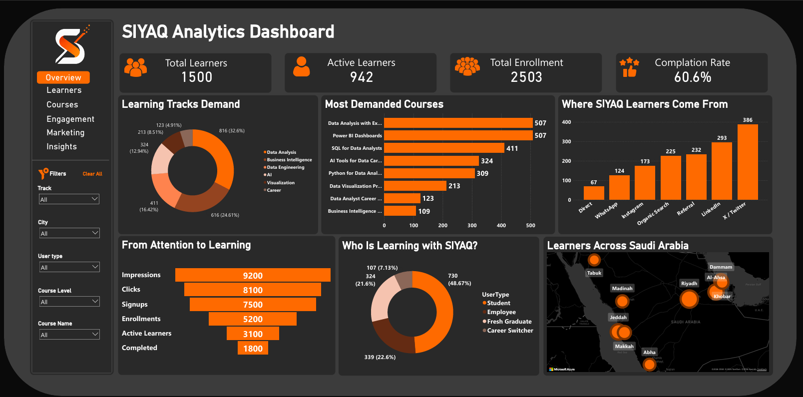

# SIYAQ Analytics Power BI Dashboard

An interactive Power BI dashboard designed to analyze SIYAQ learning platform performance, including learners, enrollments, course demand, engagement funnel, marketing channels, and learner distribution across Saudi Arabia.

## Project Overview

This project presents a full analytics dashboard for SIYAQ, a data and AI learning initiative.
The dashboard helps track how learners interact with SIYAQ courses, which learning tracks are most demanded, where learners come from, and how users move from awareness to course completion.

The goal of this dashboard is to provide a clear overview of SIYAQ’s learning performance and support better decisions in content planning, marketing, and learner engagement.

## Tools Used

* Power BI
* Power Query
* DAX
* Excel
* Data Visualization
* Dashboard Design

## Key Metrics

* Total Learners: 1,500
* Active Learners: 942
* Total Enrollment: 2,503
* Completion Rate: 60.6%
* Marketing Channels
* Course Demand
* Learner Type
* Engagement Funnel
* Learners Across Saudi Arabia

## Dashboard Sections

### 1. Overview

Shows the main KPI cards for total learners, active learners, total enrollments, and completion rate.

### 2. Learning Tracks Demand

Displays the demand distribution across learning tracks such as Data Analysis, Business Intelligence, Data Engineering, AI, Visualization, and Career tracks.

### 3. Most Demanded Courses

Highlights the most popular SIYAQ courses, including:

* Data Analysis with Excel
* Power BI Dashboards
* SQL for Data Analysts
* AI Tools for Data Careers
* Python for Data Analysis
* Data Visualization Projects
* Data Analyst Career
* Business Intelligence

### 4. Marketing Channel Analysis

Analyzes where SIYAQ learners come from, including:

* Direct
* WhatsApp
* Instagram
* Organic Search
* Referral
* LinkedIn
* X / Twitter

### 5. Engagement Funnel

Tracks the learner journey from attention to learning:

* Impressions
* Clicks
* Signups
* Enrollments
* Active Learners
* Completed

### 6. Learner Type Analysis

Shows the distribution of SIYAQ users by type:

* Student
* Employee
* Fresh Graduate
* Career Switcher

### 7. Geographic Distribution

Visualizes learner distribution across Saudi Arabia, including Riyadh, Jeddah, Al-Ahsa, Dammam, Makkah, Khobar, Madinah, Abha, and Tabuk.

## Key Features

* Interactive Power BI dashboard
* KPI cards for platform performance
* Course demand analysis
* Marketing channel performance analysis
* Learner journey funnel
* Learner type segmentation
* Geographic map visualization
* SIYAQ brand identity using dark theme and orange accents
* Clean layout designed for quick insights

## Dashboard Preview

## Files

* `SIYAQ.pbix` — Power BI dashboard file
* `dashboard-preview.png` — Dashboard screenshot

## What I Learned

* Designing a platform analytics dashboard
* Building KPI cards for learning performance
* Creating funnel analysis in Power BI
* Analyzing course demand and learner behavior
* Using maps to visualize learner distribution
* Applying brand identity inside dashboard design
* Turning educational platform data into business insights

## Author

Mohammed Alghafli
Junior Data Analyst | Software Development Trainee | Aspiring AI Engineer
Co-Founder — SIYAQ
